# Computing Exam Questions Classification Using Natural-Language Processing
## UTFPR Computer Engineering Final Project

The delay on curricular education models have been discussed and questioned. These questionings aim to meet demands that help and motivate students in the comprehension of subjects with high information quantity. Disruptive, innovative, unorthodox approaches and adaptative teaching have been presented as alternatives for students’ academic achievement improvements. These approaches have gotten into the scholar scope through technologies such as data mining and artificial intelligence, though the reach wasn’t fairly enough in the computer knowledge area. Therefore this work’s proposal aimed to develop and evaluate classification models of computer knowledge questions, using Natural-Language Processing and Machine Learning as processing techniques. Through an educational context and adaptive learning usage, the work develops an approach that goes from questions acquisition to the realization of supervised learning methods. Ultimately, the final balanced model analysis presented a precision average of 79% for all methods and a precision of 83% for Multinomial Naive Bayes. Besides using output model for future questions classification in an adaptive system, the work also managed to make a question database available with extracted and classified questions for computer teaching institutions.

## Table of Contents

[1. Overview](#overview)

[2. Techonologies and Start Working](#technologies-and-start-working)

[3. Crawling](#crawling)

[4. Data Manipulation in DB](#data-manipulation-in-db)

[5. Data Processing](#data-processing)

[6. Machine Learning Supervised Trainings](#machine-learning-supervised-trainings)

[7. Results](#results)

[8. Hardware Specifications](#hardware-specifications)

[9. Authors](#authors)

## Overview

Exploring the educational technology slope, the adaptive learning aims to improve individualized learning through identification of moments and factors which each student has a easier way of learn. This thesis' general objective was to work within part of the customized tests and exercises elaboration according to step (a) on the following figure:


On this section, the main goal is to extract and label tests questions used from different systems, focusing on IT area contribution. Therefore, it was developed and evaluated a questions classification model for each extracted theme - such as Computer Network and Databases. In addition, the goals was to obtain a consistent database with label questions, which could help teachers and adaptive systems on elaboration of directed tests to tackle each student difficulties.

The customized tests and exercises elaboration step can be seen with more details on the following figure, which has three substeps - questions search, test elaboration and information collection after the test execution:

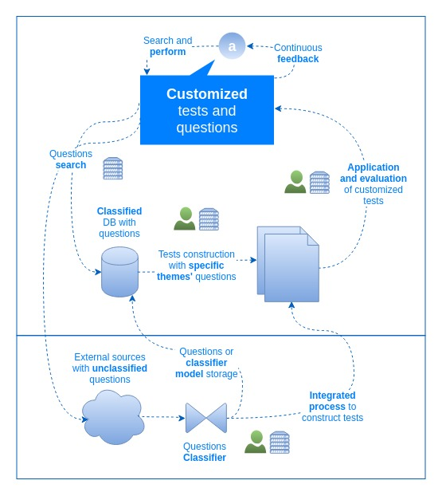

Normally these substeps work internally to adaptive systems, with automated execution based on available rules and metadata, such as each question labels. Even though systems can have some database questions, that can be limited, demanding an increasal of labeled questions to improved the customized experience of each student. Therefore, this work's developed approach was to help this process through questions extraction and classification, taking as reference the subprocess in the lower part of the above figure. The questions classification can allow to store them in a existent database and/or export the questions' classifier model. In this work the classification focus was on IT area, checking the usage viability of NLP algorithms to classify tests' questions in this specific area. A technical overall flow of the work process can be seen through the six steps of the following figure, going from the sources reading to the models evaluation:

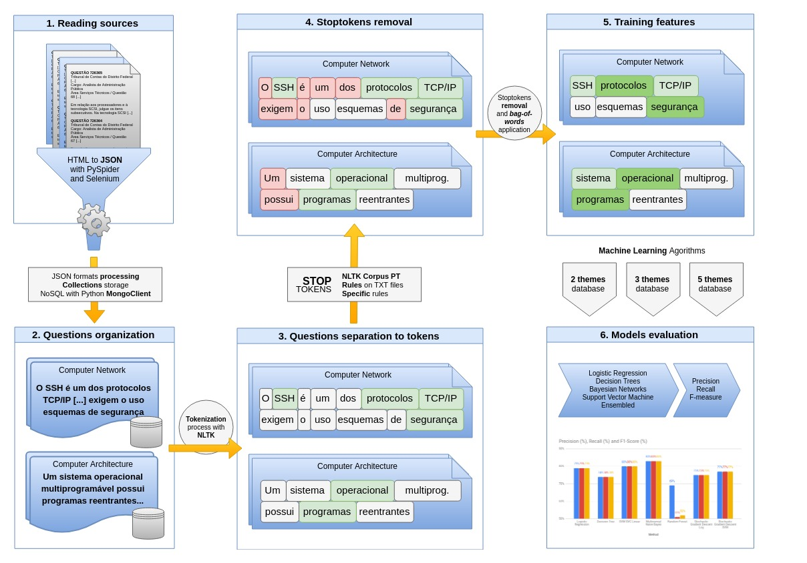

On the other side, the methodology used on the work process can be seen in the following figure:

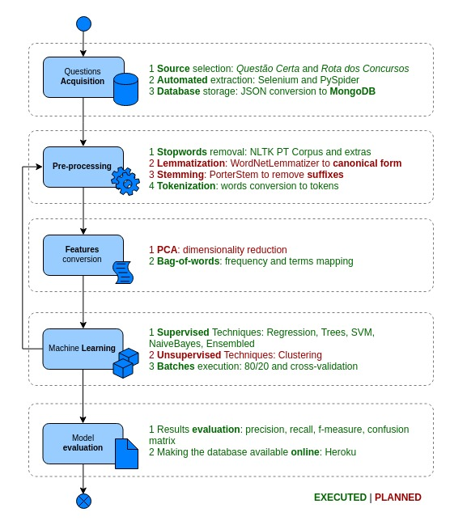

The general idea was to start with two iterations, extracting two themes and then three themes of questions. After that, a final third iteration was executed, with all themes combined from the last two iterations:

- IT1: Database (4449 questions) and Computer Network (5483 questions);

- IT2: Computer Architecture (1062 questions), Information Systems (1040 questions) and Operational Systems (2483 questions);

- IT3: Database (4449 questions), Computer Network (5483 questions), Computer Architecture (1062 questions), Information Systems (1040 questions) and Operational Systems (2483 questions).

## Technologies and Start Working

Main language usage in this project was [Python 2.7.12](https://docs.python.org/2/index.html) in Ubuntu 16.04 LTS with the following main [libraries](requirements.txt):

- [NLTK 3.3](https://www.nltk.org/)

- [NumPy 1.15.1](https://docs.scipy.org/doc/)

- [PyMongo 3.7.1](http://api.mongodb.com/python/3.7.1/changelog.html)

- [PySpider 0.3.10](http://docs.pyspider.org/en/latest/)

- [scikit-learn 0.19.2](https://scikit-learn.org/0.19/documentation.html)

- [SciPy 1.1.0](https://docs.scipy.org/doc/)

- [Selenium 3.14.0](https://seleniumhq.github.io/selenium/docs/api/py/)

To start working with the project, make sure you have Python 2.7 and Pip installed in your Linux:

```bash
$ sudo apt update
$ sudo apt-get install python
$ sudo apt-get install python-pip
```

Make sure you have installed MongoDB as well. Just follow any tutorial or [this one](https://hevodata.com/blog/install-mongodb-on-ubuntu/) to install it.

Then install the necessary packages libraries (it's recommended to use [virtualenv](https://docs.python-guide.org/dev/virtualenvs/)):

```bash
$ pip install -r requirements.txt
```

## Crawling

It was used two different types of crawling softwares using Python to extract IT questions from the two websites:

- [Rota dos Concursos](https://questoes.grancursosonline.com.br/ciencia-da-computacao) website: [PySpider 0.3.10](http://docs.pyspider.org/en/latest/)

- [Questão Certa](https://www.questaocerta.com.br/questoes) website: [Selenium 3.14.0](https://seleniumhq.github.io/selenium/docs/api/py/)

The reason the usage of two different ones were necessary was due to the fact that the second website (Questão Certa) demanded a authentication, which PySpider wasn't able to work with.

### PySpider

PySpider consists in a web crawler system developed in Python, with the following features:

- Powerful WebUI with script editor, task monitor, project manager and result viewer
- MySQL, MongoDB, Redis, SQLite, Elasticsearch; PostgreSQL with SQLAlchemy as database backend
- RabbitMQ, Beanstalk, Redis and Kombu as message queue
- Task priority, retry, periodical, recrawl by age, etc...
- Distributed architecture, Crawl Javascript pages, Python 2&3, etc...

To start working with it, open a local server in your terminal (probably will be available at localhost:5000):

```bash
$ pypsider
```

A quickstart to work with it can be found in the [software documentation](http://docs.pyspider.org/en/latest/Quickstart/). The script used to extract was the [crawler_pyspider_rota_concursos_ciencia_computacao_questions.py](crawlers/extraction/rota-dos-concursos/crawler_pyspider_rota_concursos_ciencia_computacao_questions.py) and the output process can be seen in the following image:

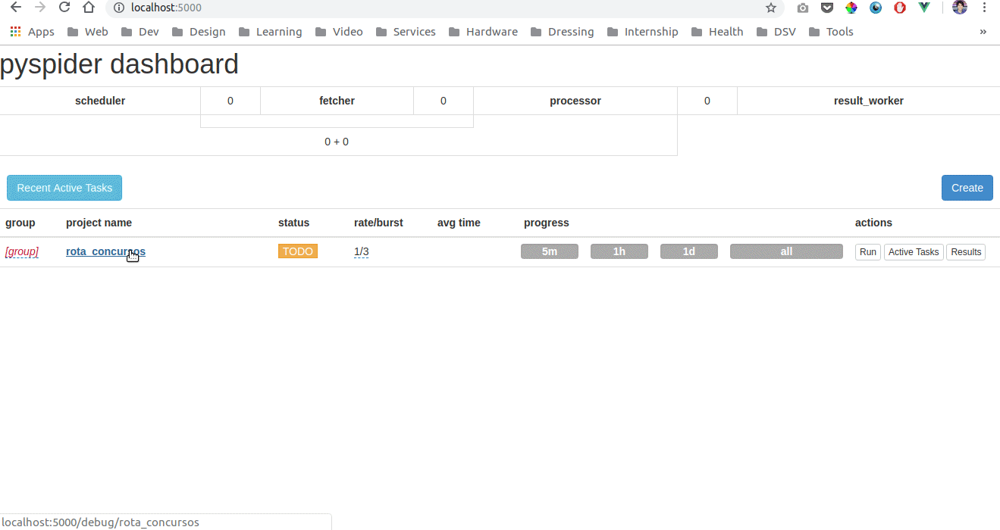

### Selenium

Selenium automates browsers. Primarily, it is for automating web applications for testing purposes, but is certainly not limited to just that. Boring web-based administration tasks can (and should!) be automated as well. Selenium has the support of some of the largest browser vendors who have taken (or are taking) steps to make Selenium a native part of their browser. It is also the core technology in countless other browser automation tools, APIs and frameworks.

A quickstart to work with it can be found in the [software documentation in Python](https://selenium-python.readthedocs.io/). The script used to extract was the [crawler_selenium_questao_certa_questions.py](crawlers/extraction/questao-certa/crawler_selenium_questao_certa_questions.py) and a simple output process can be seen in the following image (the browser can be headless):

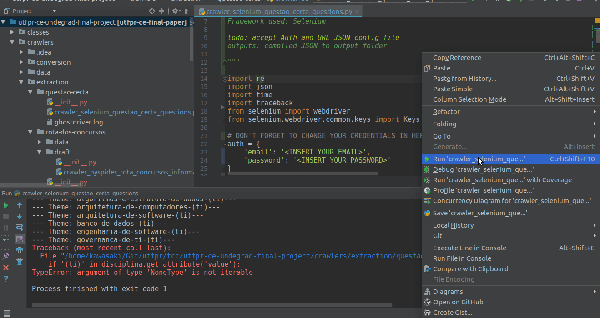

All the details can be found in each code inside [crawlers/ folder](crawlers/), however the output JSON files aren't available. You can do it on your own.

## Data Manipulation in DB

After extracting data from each website, the goal was to send all the JSON files to a MongoDB database. For the first two iterations specifics scripts were executed, while for the last iteration the combined database obtained was used.

The main idea was to use PyMongo as a database connector with Python. To make the connection smoothly as possible, a [DatabaseManipulation class](classes/DatabaseManipulation.py) was developed, with the following API methods (details can be found in the class itself):

- insert_one(database_name, collection_name, data)

- insert_many(database_name, collection_name, data_list)

- find_all(database_name, collection_name):

- find_by_object(database_name, collection_name, obj)

- count_records(database_name, collection_name)

To use it, just import the class, instantiate and call methods as the following:

```py
from classes.DatabaseManipulation import DatabaseManipulation

db = DatabaseManipulation(db_type, db_env)
db.find_all(db_name, db_collec_name)
```

Scripts for the first two iterations can be found at [database folder](database/), which has as well a [script](database/populate_all_questions_db.py) to populate the DB with all themes' questions. The requirement to use it is storing all JSON output files in folders as the following part of the code shows:

```py
# Folders with JSON inputs
qc_folder = '../crawlers/output/questao-certa'
rc_folder = '../crawlers/output/rota-dos-concursos'
```

The database population scripts output logs with the details of the JSON files inserted into the NoSQL MongoDB database:

```JSON
[
    {
        "questions_with_image": 378,
        "collection_name": "quest_db_iter_01",
        "theme": "Banco de Dados",
        "file": "questao-certa-crawler-banco-de-dados-resultados",
        "total_questions": 2115
    },
    {
        "questions_with_image": 832,
        "collection_name": "quest_db_iter_01",
        "theme": "Banco de Dados",
        "file": "rota-dos-concursos-crawler-banco-de-dados-resultados",
        "total_questions": 2334
    },
    {
        "questions_with_image": 0,
        "collection_name": "quest_rc_iter_01",
        "theme": "Redes de Computadores",
        "file": "questao-certa-crawler-redes-de-computadores-resultados",
        "total_questions": 2615
    },
    {
        "questions_with_image": 0,
        "collection_name": "quest_rc_iter_01",
        "theme": "Redes de Computadores",
        "file": "rota-dos-concursos-crawler-redes-de-computadores-resultados",
        "total_questions": 2868
    }
]
```

## Data Processing

Before training executions, data was processed and prepared for supervised trainings through tokenization, stopwords removal and bag-of-words technique application. This step was executed with some developed snippets and their respective methods:

- [misc_snippets.py](training/snippets/misc_snippets.py)

    - bind_question_text_alternatives(question)

    - tokens_to_vector(tokens, label, word_index_map)

    - has_numbers(s)

- [nlp_snippets.py](training/snippets/nlp_snippets.py)

    - tokenizer(s, config, stopwords)

    - is_stoptoken(s, config)

    - _unnaccent(s)

    - _rule_base_processing(s, rule)

## Machine Learning Supervised Trainings

The training was based on four main steps: iterations, balancing, splitting method and supervised algorithms types, which can be seen in the following figure:

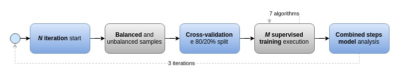

All of these steps combined, using 7 types of supervised algorithms, resulted in 10 output models with a total of 14517 questions. Each iteration was executed and can be found in the folder [training/](training/). For that executions, two snippets were developed with methods to help make the process generic:

- [training_snippets.py](training/snippets/training_snippets.py)

    - supervised_training(ml_list, split_test, k_fold, balancing,
                          iter_number, db_type, db_name, db_collection_list,
                          collection_label_list, tokenizer_config,
                          stoptoken_config, output_file_path)
        
        - Options of ml_list algorithms from sklearn: Logistic Regression, Decision Tree, SVM SVC Linear, Multinomial NaiveBayes, Random Forest, Stochastic Gradient Descent Log and Stochastic Gradient Descent SVM

        - Tokenizer configuration options: downcase, short version, Porter Stemming, stopwords reducing

        - Stoptoken configuration options: number replacement, [key base rules](rules/rule_based_key_pair.json) replacement

- [sklearn_training_snippets.py](training/snippets/sklearn_training_snippets.py)

    - train_report(data, split_test, k_fold, ml_list, file_path, header, classes)
    
    - _training_results(data_dict, split_test, k_fold, list)
    
    - _process_training(data_dict, result_dict, model, split_test, k_fold)
    
    - _log_results(file_path, header, final_results, split_test, training_len, testing_len)

All code details and process execution can be found in each snippet script. If you want to test it, try executing any of the following iteration scripts:

- [supervised-training-iter-001.py](training/supervised-training-iter-001.py)

- [supervised-training-iter-002.py](training/supervised-training-iter-002.py)

- [supervised-training-iter-003.py](training/supervised-training-iter-003.py)

## Results

Main total results were divided from unbalanced and balanced samples. The unbalanced precision average results for the all iterations can be seen in the following figure:

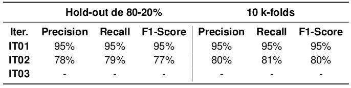

On the other hand, the balanced precision average results for the all iterations can be seen in the following figure:

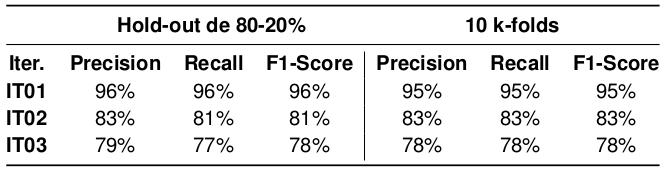

Execution timings can be seen in the following figure (check [computer hardware specifications](#hardware-specifications) for more details):

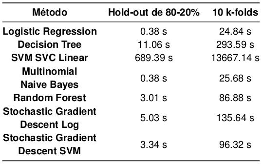

The algorithms results on the last iteration for the holdout split type can be seen in the following figure (was considered three types of measurements):

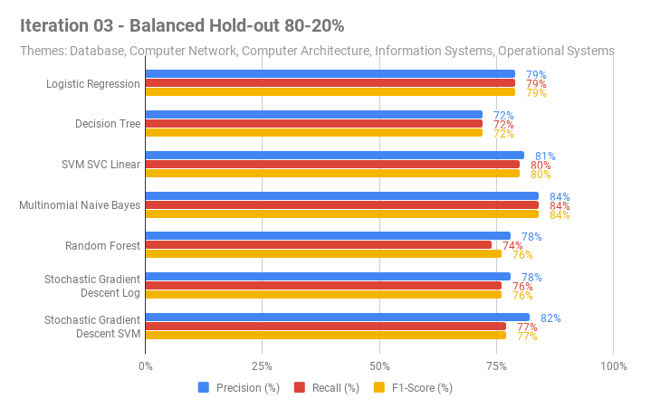

The algorithms results on the last iteration for the kfold split type can be seen in the following figure (was considered three types of measurements):

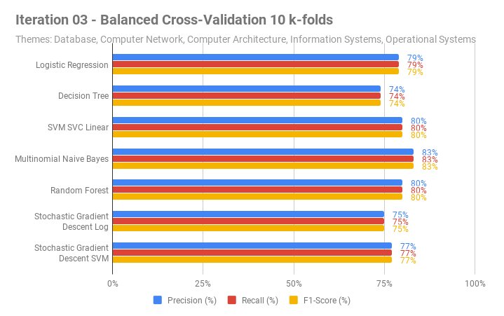

To see more details of the work done and future ideas to improve the main objective, check the developed [document thesis](docs/computing_exam_questions_classification_using_natural_language_processing_pt-br.pdf) (only in Portuguese).

## Hardware Specifications

- Memory: 7.7 GiB

- Processor: Intel® Core™ i5-7200U CPU @ 2.50GHz × 4 

- Graphics: GeForce 940MX/PCIe/SSE2

- OS: Ubuntu 16.04 LTS 64-bit

## Authors

This work was developed as my undergrad-subject final project. The people involved in the project are:

Student: KAWASAKI, Davi // davishinjik [at] gmail.com

Professor: WATANABE, Willian Massami // wwatanabe [at] utfpr.edu.br

## CONTACT & FEEDBACKS

Feel free to contact or pull request me to any relevant updates you may enquire:

KAWASAKI, Davi // davishinjik [at] gmail.com
